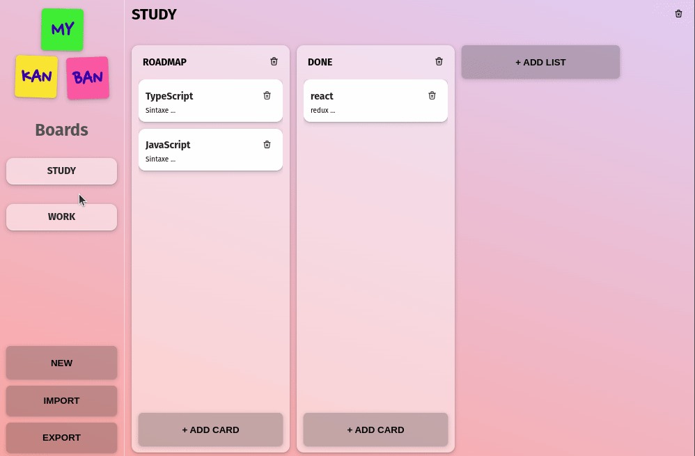

# MyKanBan

<p>Desenvolvido em Next.js, <b>MyKanBan</b> é uma aplicação que utiliza recursos como <em>Drag and drop</em>, <em>Context API</em> e <em>Rich Text</em>, para criar um quadro Kanban intuitivo que permite gerenciar suas tarefas de forma prática</p>

<p>Você pode criar vários quadros, listas e cartões de tarefas em poucos cliques.</p>

<p>Os dados ficam salvos em localStorage ou você pode exportar em um arquivo json para importar depois.</p>

<br>

## preview



## [>> Try it <<](https://cesardmn.github.io/gitshow)

<br>

## cloning and running

- require NodeJs v16.+

clone and intstall:

```bash
$ git clone https://github.com/cesardmn/mykanban.git
$ cd mykanban
$ npm i
```

run:

```bash
$ npm run dev
```

<br>
<br>

## Developed by Cesar Dimi.

[](https://www.linkedin.com/in/cesardmn/)
[](https://wa.me/5521982399315)

<br>
<br>
