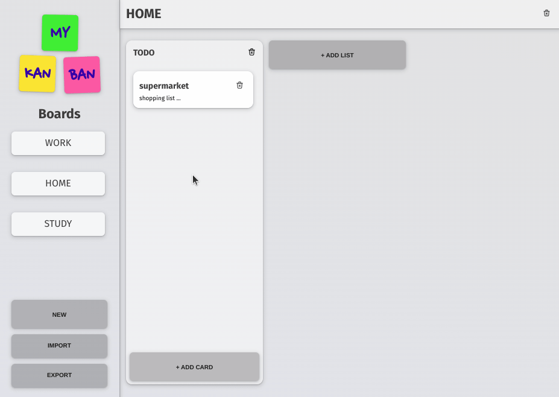

# MyKanBan

<p>Developed in Next.js, <b>MyKanBan</b> is an application that utilizes features such as <b><em>Drag and drop</em></b>, <b><em>Context API</em></b>, and <b><em>Rich Text</em></b> to create an intuitive Kanban board that allows you to manage your tasks conveniently.</p>

<p>You can create multiple boards, lists, and task cards with just a few clicks.</p>

<p>The data is stored in localStorage, or you can export it as a JSON file to import later.</p>

<br>

## preview



## [>> Try it <<](https://cesardmn.github.io/mykanban)

<br>

## cloning and running

- require NodeJs v16.+

clone and intstall:

```bash
$ git clone https://github.com/cesardmn/mykanban.git
$ cd mykanban
$ npm i
```

run:

```bash
$ npm run dev
```

<br>
<br>

## Developed by Cesar Dimi.

[](https://www.linkedin.com/in/cesardmn/)
[](https://wa.me/5521982399315)

<br>
<br>
